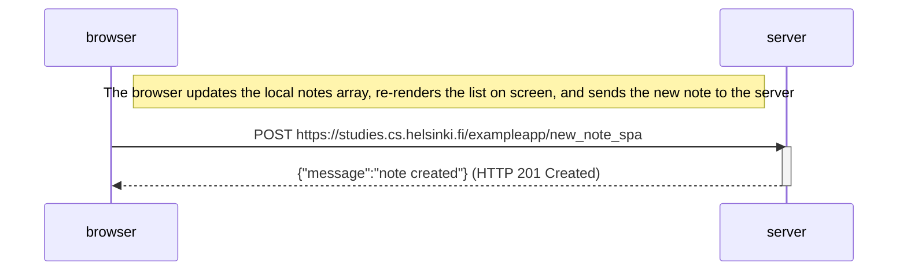

## 0.6: SPA - New Note Sequence

_Assumption: The user has already opened `https://studies.cs.helsinki.fi/exampleapp/spa` and initial page resources are loaded._

```mermaid
sequenceDiagram
    participant browser
    participant server

    Note right of browser: The browser updates the local notes array, re-renders the list on screen, and sends the new note to the server

    browser->>server: POST https://studies.cs.helsinki.fi/exampleapp/new_note_spa
    
    activate server
    server-->>browser: {"message":"note created"} (HTTP 201 Created)
    deactivate server


```
    